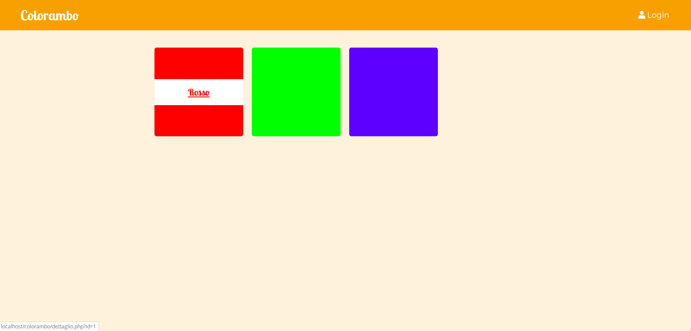
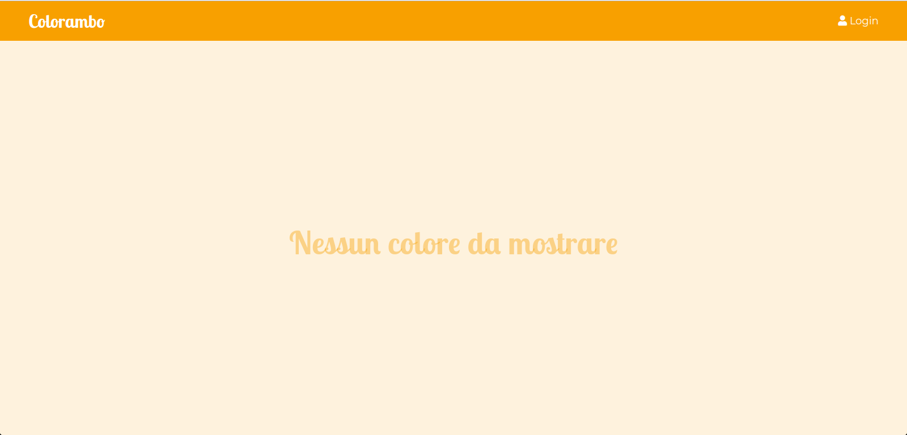

# Colorambo: a Color Management System



## Introduzione

*Colorambo* è una semplice applicazione Web scritta in PHP. 

E' stata realizzata come esercizio di integrazione tra programmatori *Front End* e *Back End*. 

## Installazione

Per *installare* questa applicazione è sufficiente clonare questo repository git all'interno della cartella `htdocs` presente nella directory di installazione della propria distribuzione Xampp (tipicamente, su Windows, in `C:\xampp\htdocs`.

Per clonare il repository si consiglia di utilizzare l'interfaccia da riga di comando di `git`, accessibile attraverso il terminale di Windows oppure usando il terminale integrato dell'editor Visual Studio Code. 

In alternativa, è sempre possibile usare software con Interfaccia Grafica (*GUI*), ad esempio GitKraken, per svolgere le stesse funzioni. 

Questi i passaggi necessari per clonare il repository: 

* Dirigersi nella cartella `htdocs` con il comando `cd` (**c**hange **d**irectory): 
``` cd /c/xampp/htdocs ```

* Copiare il contenuto del repository `git` all'interno della cartella:
``` git clone https://github.com/giacomoalbe/colorambo.git ```

* Inserire le proprie credenziali GitHub (username e password). 
* Il comando precedente copiera il contenuto del repository all'interno della cartella `htdocs/colorambo`.
* A questo punto, assicurandosi di aver fatto partire i server Xampp Apache e Mysql, dirigersi, utilizzando il proprio browser preferito, all'indirizzo `http://localhost/colorambo`. 
* A questo punto dovreste vedere la pagina principale di *Colorambo*, come nell'immagine sottostante: 




## Primi Passi

Come prima cosa è necessario creare la struttura in grado di immagazzinare i dati che l'applicazione andrà ad utilizzare. 

In particolare è necessario creare: 

1. il **database**
1. le **tabelle**
1. l'utente principale (utente **admin**)
1. Un certo numero di *colori di default* che saranno presenti di _default_ all'interno della nostra applicazione. 


I primi due passaggi vengono comunemente chiamati "database creation" o "database migration", nel senso che sono necessari per creare la struttura di base del database. 

Gli step 3 e 4, invece, fanno parte del processo di *popolamento* del database, ovvero aggiungono i dati iniziali che sono necessari ad un corretto funzionamento dell'applicazione. 

Senza un utente autenticato (l'utente admin) non è possibile creare o modificare i colori, quindi l'applicazione diventa inutilizzabile. 

Parimenti, senza alcun colore visualizzato, non è possibile testare da subito il funzionamento dell'applicazione, nel caso in cui l'utente non fosse loggato. 

Per attivare i due passaggi sopraelencati, andremo a richiamare due file `php` contenuti all'interno del progetto, che, comunicando direttamente con il server di database che abbiamo inizializzato da Xampp, andranno, rispettivamente, a creare il db e a popolarlo con i dati di base.

### Creazione DB

Andare nel browser e digitare il seguente indirizzo: 

```http://localhost/colorambo/create_db.php```

Una volta fatto questo dovrebbero comparire 4 scritte che indicano la corretta creazione del database e delle cartelle

### Popolamento DB

Andare nel browser e digitare il seguente indirizzo: 

```http://localhost/colorambo/populate_db.php```

Questa pagina dovrebbe restituire il risultato della creazione dell'utente admin e di 3 colori (i colori primari della sintesi addittiva del colore - rosso, verde, blu -). 

In caso la procedura non andasse a buon fine significa che c'è un problema di connessione al DB. Assicurarsi che il server di database sia acceso nel pannello dei servizi di Xampp. 

## Funzionamento

L'applicazione ha lo scopo di mostrare diversi paradigmi per far comunicare correttamente un reparto di *BackEnd* con uno di *FrontEnd*.

La tecnica principale è quella del *divide et impera*, ovvero quella di separare i file contenenti la visualizzazione da quelli che si occupano invece di gestire la *business logic* dell'applicazione. 

In questo modo i *Front End* si possono concentrare sul rendere disponibili le infomazioni e interagire con l'utente, mentre i *BackEnd* si occupano di comunicare le informazioni che arrivano dal client ai vari servizi orientati a gestire l'informazione. 

Quello che serve è definire un'**interfaccia** per comunicare efficacemente tra le parti. 

L'interfaccia consta di 

* Strutture Dati
* Nomi di funzioni
* Nomi di file

A questo proposito, i *FrontEnd (FE)* troveranno utile guardare i file:

* `index.php`
* `dettaglio.php`
* `login.php`

Per i *BackEnd (BE)*, invece, i file da visionare sono i seguenti:

* `controller.php`
* `utility.php`
* `populate_db.php`
* `create_db.php`


